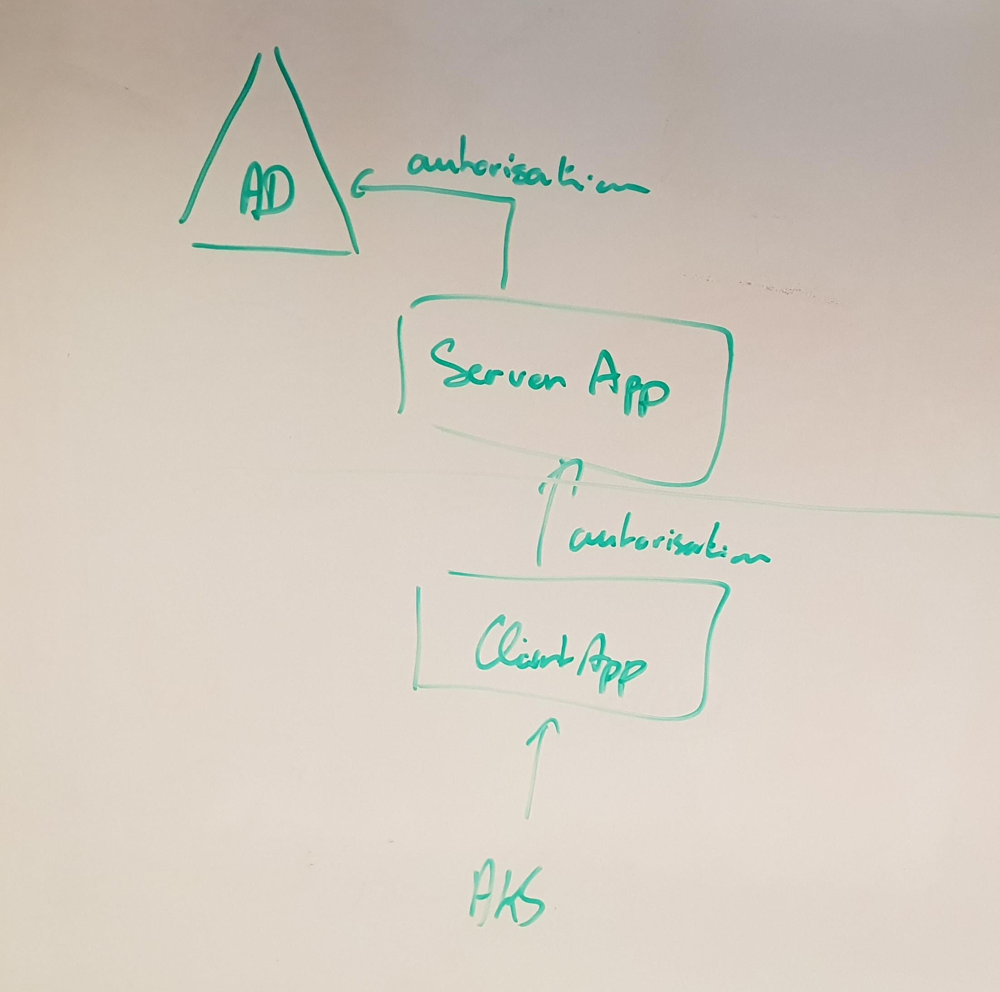
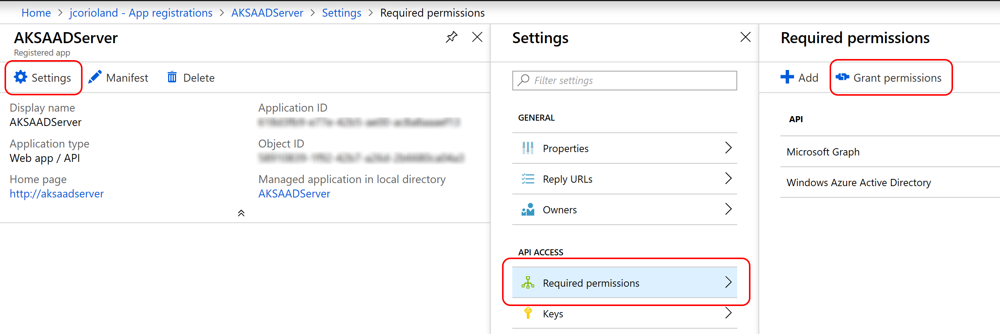

# Secure an Azure Kubernetes cluster with Azure Active Directory and RBAC

This repository contains scripts that help to automate the deployment of an RBAC-enabled Azure Kubernetes Service cluster backed by Azure Active Directory, using Azure CLI and Terraform.

## Azure Active Directory

Before getting started, read this [documentation page](https://docs.microsoft.com/en-us/azure/aks/aad-integration) that explains how to configure AKS to use RBAC and Azure Active Directory manually.

To enable Azure Active Directory autorization with Kubernetes, you need to create two applications:

- A server application, that will work with Azure Active Directory
- A client application, that will work with the server application

Multiple AKS clusters can use the same server application, but it's recommended to have one client application per cluster.



### Create the server application

It's possible to scripts almost all the creation of the Active Directory server application, but you will need to go to the portal to grant the permissions manually after it has been created as it requires some [Admin-restricted permissions](https://docs.microsoft.com/en-us/azure/active-directory/develop/v2-permissions-and-consent#admin-restricted-permissions) at the application level.

Open the [server application creation script](azure-ad/create-azure-ad-server-app.sh) and update the environment variables with the values you want to use:

```bash
export RBAC_AZURE_TENANT_ID="REPLACE_WITH_YOUR_TENANT_ID"
export RBAC_SERVER_APP_NAME="AKSAADServer2"
export RBAC_SERVER_APP_URL="http://aksaadserver2"
export RBAC_SERVER_APP_SECRET="$(cat /dev/urandom | tr -dc 'a-zA-Z0-9' | fold -w 32 | head -n 1)"
```

Then execute the script:

```bash
cd azure-ad
./create-azure-ad-server-app.sh
```

Once created, open the Azure Portal, and browse your application through Azure Active Directory > App registrations > View all applications > NAME_OF_YOUR_APP > Settings > Required Permissions

Click the `Grant permissions` button and accept to grant the permissions for the tenant:



Copy the `export` directive that have been generated by the scripts and past them into the [client application creation script](azure-ad/create-azure-ad-client-app.sh) to replace the existing placeholders:

```bash
export RBAC_SERVER_APP_ID="COMPLETE_AFTER_SERVER_APP_CREATION"
export RBAC_SERVER_APP_OAUTH2PERMISSIONS_ID="COMPLETE_AFTER_SERVER_APP_CREATION"
export RBAC_SERVER_APP_SECRET="COMPLETE_AFTER_SERVER_APP_CREATION"
```

You can reuse the same server application for all your Azure Kubernetes Service cluster.

### Create the client application

The creation of the client application is fully scripted. Make sure to have the right values for the environment variables export at the begining of the [client application creation script](azure-ad/create-azure-ad-client-app.sh) and execute it:

```bash
cd azure-ad
./create-azure-ad-client-app.sh
```

Once completed, the script output environment variables export directive that you can copy for later deployment using Terraform.

## Terraform deployment

Since v1.19 Azure RM Terraform provider supports AKS deployment using RBAC + Azure Active Directory.
The `terraform` folder of this repository contains everything you need to deploy the cluster.

First, you may want to edit the [variables.tf](terraform/variables.tf) file to fill the different variables with the right names / values for your environment.

Then, you need to export the following environment variables:

```bash
export TF_VAR_client_id=SERVICE_PRINCIPAL_CLIENT_ID
export TF_VAR_client_secret=SERVICE_PRINCIPAL_CLIENT_SECRET
# the following exports are in the output of the client application creation script
export TF_VAR_rbac_server_app_id=RBAC_SERVER_APP_ID
export TF_VAR_rbac_server_app_secret=RBAC_SERVER_APP_PASSWORD
export TF_VAR_rbac_client_app_id=RBAC_CLIENT_APP_ID
export TF_VAR_tenant_id=AZURE_TENANT_ID
```

### Initialize Terraform

```bash
terraform init -backend-config="storage_account_name=YOUR_AZURE_STORAGE_ACCOUNT_NAME" \
    -backend-config="container_name=tfstate" \
    -backend-config="access_key=YOUR_STORAGE_ACCOUNT_KEY" \
    -backend-config="key=NAME_OF_YOUR_STATE_FILE.tfstate"
```

### Create the Terraform plan

```bash
terraform plan -out "out.plan"
```

### Apply the Terraform plan

```bash
terraform apply "out.plan"
```

Wait for the Azure Kubernetes Service cluster to be completed.

## Configure Kubernetes RBAC

Now that the cluster is deployed and secured using RBAC and Azure Active Directory, you need to create Role/RoleBinding, ClusterRole/ClusterRoleBinding object using the Kubernetes API to give access to your Azure Active Directory user and groups.

In order to do that, you need to connect to the cluster. You can get an administrator Kubernetes configuration file using the Azure CLI:

```bash
az aks get credentials -n CLUSTER_NAME -g RESOURCE_GROUP_NAME --admin
```

The repository contains a [simple ClusterRoleBinding object definition file](k8s-rbac/cluster-admin-rolebinding.yaml) that will make sure that the Azure Active Directory user `johndoe@jcorioland.onmicrosoft.com` get `cluster-admin` role:

```yaml
apiVersion: rbac.authorization.k8s.io/v1
kind: ClusterRoleBinding
metadata:
  name: aks-cluster-admins
roleRef:
  apiGroup: rbac.authorization.k8s.io
  kind: ClusterRole
  name: cluster-admin
subjects:
- apiGroup: rbac.authorization.k8s.io
  kind: User
  name: "johndoe@jcorioland.onmicrosoft.com"
```

You can update this first cluster role binding and apply it using:

```bash
kubectl apply -f k8s-rbac/cluster-admin-rolebinding.yaml
```

You can also create RoleBinding/ClusterRoleBinding for Azure Active Directory group, as described [here](https://docs.microsoft.com/en-us/azure/aks/aad-integration#create-rbac-binding).

## Connect to the cluster using RBAC and Azure AD

Once all you RBAC objects are defined in Kubernetes, you can get a Kubernetes configuration file that is not admin-enabled using the `az aks get-credentials` command without the `--admin` flag.

```bash
az aks get credentials -n CLUSTER_NAME -g RESOURCE_GROUP_NAME
```

When you are going to use `kubectl` you are going to be asked to use the Azure Device Login authentication first:

```bash
kubectl get nodes

To sign in, use a web browser to open the page https://microsoft.com/devicelogin and enter the code BUJHWDGNL to authenticate.
```

